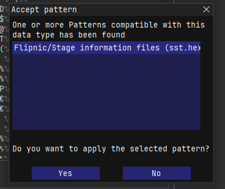

# Flipnic hex patterns

This repository contains hex patterns that can be used with ImHex and are specific to various file formats used by the Flipnic PlayStation 2 game.

This is a part of the Flipnic extraction project, where we try to understand as much of the game's file formats as possible.

* [binfile.hexpat](patterns/binfile.hexpat) - Virtual filesystem for .BIN blob files [VFS support]
* [folder.hexpat](patterns/folder.hexpat) - Subfolders in .BIN blob files [VFS support]
* [fpc.hexpat](patterns/fpc.hexpat) - Camera sequences (.FPC)
* [hd.hexpat](patterns/hd.hexpat) - Soundbank (VAB) header file
* [ipu.hexpat](patterns/ipu.hexpat) - Flipnic uses IPU video streams, which can be extracted by demuxing the .PSS file
* [msg.hexpat](patterns/msg.hexpat) - JA.MSG file (strings used by the game)
* [pss.hexpat](patterns/pss.hexpat) - Custom .PSS container, which contains audio/video streams
* [savefile.hexpat](patterns/savefile.hexpat) - Save file format
* [scc.hexpat](patterns/scc.hexpat) - Microsoft SourceSafe Source Code Control files (VSSVER.SCC)
* [sst.hexpat](patterns/sst.hexpat) - Stage definition files (.SST)
* [tim2.hexpat](patterns/tim2.hexpat) - Texture files (.TM2)
* [saveicon.hexpat](patterns/saveicon.hexpat) - Save file icon (FICON.ICO)
* [lit.hexpat](patterns/lit.hexpat) - Environment lighting table (.LIT)
* [vsd.hexpat](patterns/vsd.hexpat) - Vibration strength data (.VSD)

Incomplete patterns:

* [col.hexpat](patterns/col.hexpat) - Collision maps (.COL)
* [fpd.hexpat](patterns/fpd.hexpat) - Object movement data (.FPD)
* [ftl.hexpat](patterns/ftl.hexpat) - Texture list (.FTL)
* [mlb.hexpat](patterns/mlb.hexpat) - Layout for various in-game menus (.MLB)
* [lay.hexpat](patterns/lay.hexpat) - The game uses these files to find where things are on the stage, as well as scaling and skew effects (.LAY)
* [lp4.hexpat](patterns/lp4.hexpat) - Game resource file (usually 3D models and 2D text animations)

## Importing these files

1. Clone this repository
2. Open ImHex
3. Go to Extras > Settings > Folders
4. Add a folder that points to this repository (IMPORTANT: choose the root directory, not patterns folder)
5. Close the Settings window
6. You can now apply a pattern if you go to File > Import > Pattern file

If you open a file with a known header, ImHex will automatically prompt you to apply a pattern: 

## Progress

| Extension  | Description                | Decode | Generate | Notes                                                                                                                                            | Tool(s)                 |
|------------|----------------------------|--------|----------|--------------------------------------------------------------------------------------------------------------------------------------------------|-------------------------|
| BIN        | Blob files                 | ✅     | ✅       | Can generate, but making a RES.BIN from scratch causes the game to crash                                                                         | [FBE](https://github.com/MarkusMaal/FlipnicBinExtractor)/[FFS](https://github.com/MarkusMaal/FlipnicFs)/[FFT](https://github.com/MarkusMaal/FlipnicFileTools)                                                    |
| COL        | Collision maps             | ✅     | ❌       | Appears to have similar structure to LP4 files                                                                                                   | [FFT](https://github.com/MarkusMaal/FlipnicFileTools)                     |
| CSV        | Comma seperated values     | ✅     | ✅       | Development left-overs, unused by the game                                                                                                       | Text editor/spreadsheet |
| FPC        | Camera sequences           | ✅     | ⚠️       | Can also contain camera animations. Can't generate camera animations, but static camera positions can be generated with FFC                                           | [FFT](https://github.com/MarkusMaal/FlipnicFileTools)/[FFC](https://gist.githubusercontent.com/MarkusMaal/bc9b2d7497d67cb1a17e1ad1d61ca0eb/raw/cceecf9cc0b287f5879706c9ac4b811a80a27a2c/FlipnicFreecam-public.CT)                 |
| FPD        | Model movement sequences   | ⚠️     | ❌       | Partial decoding in a pre-release version of FFT                                                                                                 | [FFT](https://github.com/MarkusMaal/FlipnicFileTools)                     |
| FTL        | (Font?) texture lists      | ✅     | ❌       | Decoding is possible with a pre-release version of FFT. Stores a list of textures for fonts, similar to FTEXLIST.TXT, but in a binary format.                        | [FFT](https://github.com/MarkusMaal/FlipnicFileTools)                     |
| HD/BD      | VAB soundbank files        | ⚠️     | ❌       | Proprietary soundbank format (JAM) used by some first-party PS1/PS2 games. SFX decoding not possible yet.                                        | [FFT](https://github.com/MarkusMaal/FlipnicFileTools)                     |
| ICO        | Save file icon             | ✅     | ✅       | Apparently a standard format                                                                                                                     | [PS2 Save Builder](https://www.ps2savetools.com/download/ps2-save-builder/)/[ps2iconsys](https://github.com/ticky/ps2iconsys.git)   |
| LAY        | Layout files               | ✅     | ⚠️       | Defines where the various objects on the stage are located. Decoding works in latest beta builds of FFT and generation requires existing file.   | [FFT](https://github.com/MarkusMaal/FlipnicFileTools)                     |
| LIT        | Light tables               | ✅     | ❌       | Controls how the stage is lit                                                                                                                    | [FFT](https://github.com/MarkusMaal/FlipnicFileTools)                     |
| LP4        | 3D model files             | ⚠️     | ❌       | Binary format, supports UV maps, vertex point compression, static animations, bounding box and more. Decoding is possible, but unreliable.       | [FFT](https://github.com/MarkusMaal/FlipnicFileTools)                     |
| MID        | MIDI sequences             | ✅     | ✅       | Just general MIDI played on specific channels specified by .HD/.BD files                                                                         | [FFT](https://github.com/MarkusMaal/FlipnicFileTools)/Midi sequencers     |
| MLB        | Menu layout (binary?)      | ✅     | ❌       | Used to stitch various textures together to create a menu interface                                                                              | [FFT](https://github.com/MarkusMaal/FlipnicFileTools)                     |
| MSG        | Message tables             | ✅     | ✅       | Strings used by the game                                                                                                                         | [FFT](https://github.com/MarkusMaal/FlipnicFileTools)/[FSE](https://github.com/MarkusMaal/FlipnicSaveEditor)/Private tools   |
| PSS        | Interleaved audio/video    | ✅     | ⚠️       | Generation is only possible with a donor file and audio stutters                                                                                 | [FBE](https://github.com/MarkusMaal/FlipnicBinExtractor)/[FFS](https://github.com/MarkusMaal/FlipnicFs)/[FFT](https://github.com/MarkusMaal/FlipnicFileTools)                                                    |
| PSS.INT    | Audio stream               | ✅     | ✅       | Stereo Sony ADPCM compressed audio stream (interleave 0x400)                                                                                     | [FFT](https://github.com/MarkusMaal/FlipnicFileTools)/[MFAudio](https://gamebanana.com/tools/6656)             |
| PSS.IPU    | IPU video                  | ✅     | ✅       | Modified version of M2V for PlayStation 2                                                                                                        | [FFT](https://github.com/MarkusMaal/FlipnicFileTools)/[FFmpeg](https://ffmpeg.org)/ps2str       |
| SCC        | Source Code Control files  | ⚠️     | ❌       | Development left-overs, unused by the game. Supposedly has timestamps, but those use an unknown encoding.                                        | [FFT](https://github.com/MarkusMaal/FlipnicFileTools)/Microsoft Visual SourceSafe |
| SST        | Stage (special?) table     | ⚠️     | ⚠️       | Contains stuff like gimmicks, list of files and event system. Can only generate gimmick tables with existing files (FFT beta)                    | [FFT](https://github.com/MarkusMaal/FlipnicFileTools)                     |
| SVAG       | Mono audio stream          | ✅     | ✅       | Sony ADPCM compressed again, but single audio channel this time                                                                                  | [FFT](https://github.com/MarkusMaal/FlipnicFileTools)/[MFAudio](https://gamebanana.com/tools/6656)             |
| TM2        | Texture image map 2 (TIM2) | ✅     | ✅       | Standard texture file for PlayStation 2 games                                                                                                    | [FFT](https://github.com/MarkusMaal/FlipnicFileTools)/XnViewMP/etc.       |
| VSD        | Vibration data             | ✅     | ❌       | Controls when the controller should vibrate, maybe has relations to gimmicks                                                                     | [FFT](https://github.com/MarkusMaal/FlipnicFileTools)                     |
| XML        | eXtensible Markup Language | ✅     | ✅       | Developer left-overs, unused by the game                                                                                                         | Text editor             |
| GAME_ID    | Save file format           | ✅     | ✅       | Checksums are just CRC-32/JAMCRC, primary at 0xC, secondary at 0x8                                                                               | [FSE](https://github.com/MarkusMaal/FlipnicSaveEditor)                     |
| GAME_ID    | Game executable (footer)   | 🚫     | 🚫       | Some strings and memory addresses can be modified to change menu actions (see [FlipnicDecomp](https://github.com/MarkusMaal/FlipnicDecomp))                                                     | N/A                     |

✅ Working&nbsp;&nbsp;&nbsp;&nbsp;❌ Not working&nbsp;&nbsp;&nbsp;&nbsp;⚠️️ Read notes&nbsp;&nbsp;&nbsp;&nbsp;🚫 Not applicable
